---

# Welcome to my PLC production line!🧑‍🔧⚙️

This project is a month-long PLC automation project where I designed and programmed a working production line using Ladder Logic (LAD) on a Siemens PLC in TIA Portal. The system coordinates multiple parts of the line, including supply and storage sections, pick-and-place mechanisms for different box sizes, and various sensors, to move and process boxes automatically on the conveyor. With almost 30-40 hours of dedication per week, this is by far one of the biggest projects I have done in awhile, so I decided to share some of the most important takeaways and a deep dive of my project.

[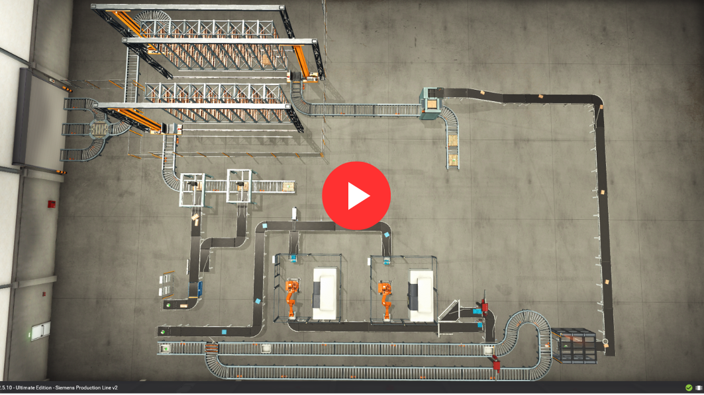](https://youtu.be/5A12SyY_Ukg)

## Table of Contents
- [Production Line Components](#production-line-components)
- [Project Motivation](#project-motivation)
- [Project Gap](#project-gap)
- [Backend PLC Programming](#backend-plc-programming)
  - [1. Categorize Your IO Tags](#1-categorize-your-io-tags)
  - [2. Modular & Structured Programming](#2-modular--structured-programming)
  - [3. Timers & Counters Techniques](#3-timers--counters-techniques)
  - [4. Fault & Safety Techniques](#4-fault--safety-techniques)
  - [5. Sequential Programming](#5-sequential-programming)
  - [6. Analog Signal Handling](#6-analog-signal-handling)
  - [7. Naming & Documentation Standards](#7-naming--documentation-standards)
- [Frontend Simulation](#frontend-simulation)
  - [General Components Used](#general-components-used)
  - [Station 1: Control Panel](#station-1-control-panel)
  - [Station 2: Incoming Supply Storage](#station-2-incoming-supply-storage)
  - [Station 3: CNC Station & Component Assembly](#station-3-cnc-station--component-assembly)
  - [Station 4: Pallet](#station-4-pallet)
  - [Station 5: Loading Station](#station-5-loading-stationautonomous-forklifts)
- [Traces and Analysis](#traces-and-analysis)
  - [1. Sensor Hiccups](#1-sensor-hiccups)
  - [2. Analog Noises](#2-analog-noises)
- [Final Thoughts](#final-thoughts)
  - [Future Research](#future-research)
  - [Reference](#reference)

## Production line components

The production line consists of five stations: Control panel, incoming supply storage, component assembly, pallet and loading stations. During the transfer process it involves machining, pick and place mechanism and sensor controls. Below I will be sharing my experiences and mistakes I have made so that you don't have the make the same mistake again.

### Applications used:

1. Siemens TIA portal v20 — Backend PLC programming tool application
2. PLCSIM — Simulating a Siemens S7-1200 PLC controller 
3. Factory I/O — Frontend simulation

## Project motivation

This project is mainly to gain better insights of how an automated production line works in the industry, as well as understanding the common challenges that PLC programmers faced it involes controlling different industrial machines programmed and how they incorporated together. To line up all the dots and getting to utilize all the machines provided by FACTORY I/O. Here is my process design of my production line.

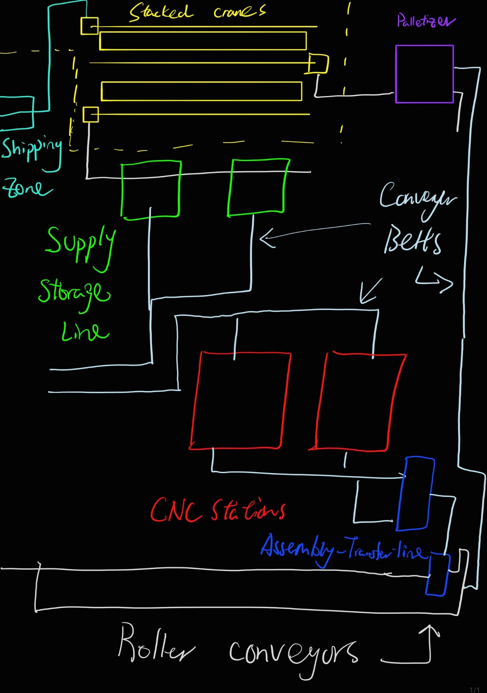

## Project Gap

Even though we get to see how industrial machines work with PLC program through a simulator, the results in simulation are still superficial and not fully comprehensive, FACTORY I/O cannot 100% simulate the real impacts of machine faults ran though the program, therefore the learning outcome of the simulation could help programmers to develop PLC programming practices that fulfills the industrial standards and learning how to troubleshoot programming(backend) errors.

## Backend PLC programming

Here I will be sharing my general practices that I have learnt in school and how different that I have applied here to make a efficient, scalable and reliable system.

### 1. Categorize your IO tags

Categorizing IO tags is very essential and beneficial since programming every station would require at least 10 IOs, therefore organizing IOs with tag folders with the appropriate comments would help during the long run from the programming and troubleshooting perspective. It makes your I/O tags way more organized and easy to track all relevent I/Os for each station.

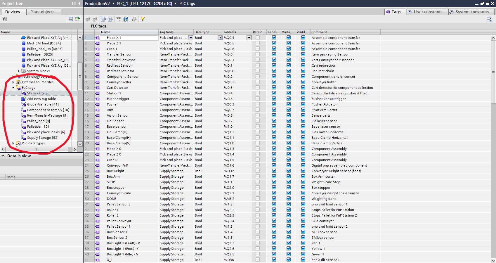

### 2. Modular & Structured Programming

Breaking logic into focused Function Blocks (FBs) is essential for maintainability, it makes the program simpler to interpret and easier for maintenance, it can also be called while running just like functions in other software programming languages. I programmed each FB to handle a single task, for example, the `Palletizer`function only controls the Palletizer machine, all relevant LAD will be written in the FB and later called from the Main block. 

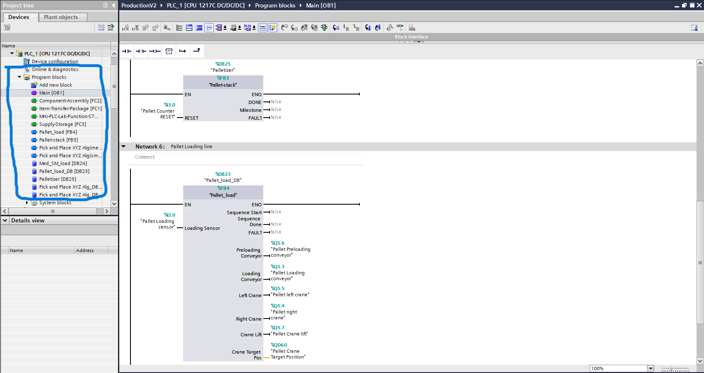

### 3. Timers & Counters Techniques

The following are the optimal use cases for timers and counters:

| Technique | Use Case |
| --- | --- |
| **TON** (On-delay timer) | Debounce sensors, delay step transitions |
| **TOF** (Off-delay timer) | Keep outputs active briefly after condition clears |
| **CTU/CTD** (Up/Down counter) | Track pallet counts, cycle counts |
| **TONR** (Retentive timer) | Accumulate runtime hours for maintenance tracking |

### 4. Fault & Safety Techniques

Fault and safety techniques in PLC programming revolve around layered protection: 

1. **Watchdog timers** — set a max time per step; if exceeded, trigger a fault alarm — critical for your robotic arm misplacement issues
2. **Interlock logic** — prevent simultaneous conflicting outputs (e.g., arm moving while gripper is mid-action)
3. **Manual / Auto / Maintenance modes** — always structure your program with mode selection logic so technicians can override safely
4. **Limit OTL/OTU latches** — minimize latched outputs; prefer SR/RS flip-flop blocks for clarity

The overall priority list(level 1 as lowest, level 5 as highest):

- Level 5: E-Stop → Cut all outputs, halt everything
- Level 4: Safety Interlock violation → Halt sequence, set fault
- Level 3: Watchdog timeout → Halt sequence, set step fault
- Level 2: Sensor/feedback fault → Set specific fault bit
- Level 1: Warning → Log event, continue operation

### 5. Sequential Programming

Sequential programming in a PLC is used whenever a machine needs to follow a specific and repeatable order of operations. Instead of every part of the program fighting for control at once, the code is structured so that "Step 2" cannot happen until "Step 1" is successfully completed. This is the most common "State Machine" logic, where the PLC tracks exactly which phase of a process the machine is currently in. 

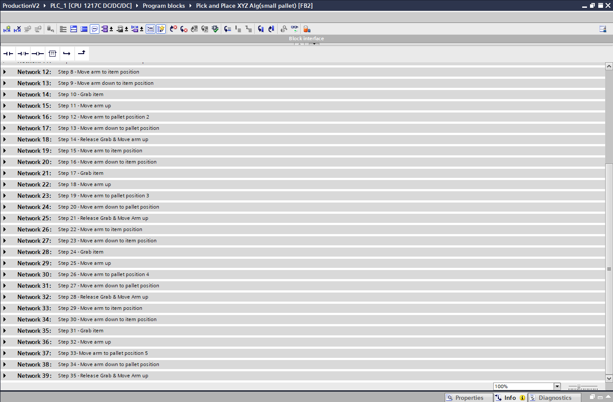
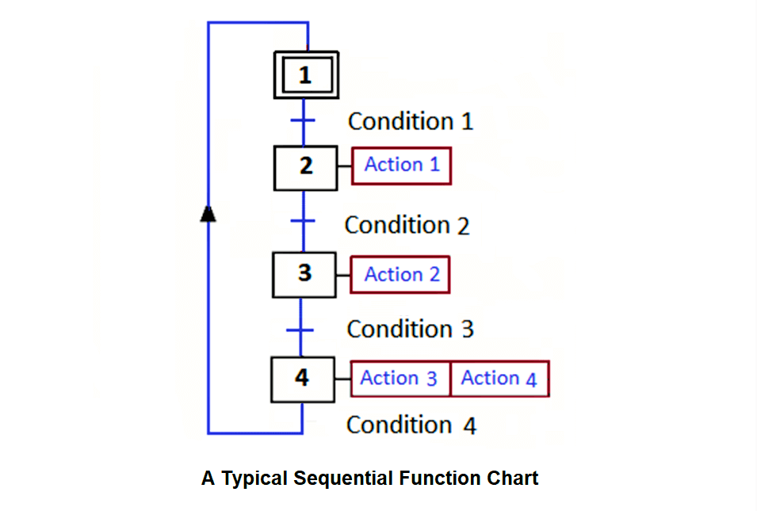

One good practice to easily sort out the basic sequential operation of a machine is to draw a **Sequential Function Chart (SFC)**, have one side identifying what you want the machine to do throughout the process. To make a strong sequential operations, here are the objectives:

- Have 4 important feedback alarms:
    - Idle - The Sequence isn’t triggered
    - Start - The Sequence begins
    - Done - The Sequence finishes
    - Fault - The Sequence ran into an issue
- Ensure the sequence does not bounce back to previous steps
- Create transition delays per step(depends on machine’s operating time per step)
- Having a real-time feedback(e.g using an HMI), this ensures operators easily identify the issue during a specific sequence.

### Sequence Control Techniques

- **State machine pattern** — implement steps as DINT variables with clearly defined transitions, exactly like your `#Step` and `C_limit` structure
- **P_TRIG / N_TRIG (edge detection)** — use rising/falling edge triggers to advance steps only once per condition, preventing runaway logic
- **One-shot transitions** — always gate step advancement with edge triggers, not level signals

### 6. Analog Signal Handling

Analog signal Handling could get really tricky at the beginning as PLC is mostly binary control operation, in other words the input or the output only has two states: true and false. To make the input or output dynamic, we can simply change the data type as a real or double integer(depending on use case). You make use to do the following: 

- **Scaling** — always scale raw analog values (e.g., `%QD48`) to engineering units using `NORM_X` + `SCALE_X` blocks in TIA Portal
- **Deadband / position windows** — instead of exact equality checks, use `lower < value < upper` comparisons for position confirmation.
- **Low-pass filtering** — apply averaging or PT1 filter blocks on noisy analog inputs before using them in control logic

### 7. Naming & Documentation Standards

Always use **symbolic names** like `#SP_X` or `#Step` instead of raw addresses like `%QD48`, since symbolic names make your logic readable to anyone reviewing or maintaining the code without needing to cross-reference an address map. Every network should have a descriptive comment — following the same pattern as your Network 5 "Move arm to item position" — so that the intent of each rung is immediately clear during troubleshooting. Finally, adopt consistent tag prefixes across your entire project: `i_` for inputs (e.g., `i_Gripper_Feedback`), `o_` for outputs (e.g.,`o_Gripper_Enable`), `s_` for setpoints (e.g., `s_SP_X`), and `f_` for faults (e.g.,`f_Step1_Timeout`), this convention makes it instantly obvious what a tag does just by reading its name, which is especially valuable when navigating large projects like your ProductionV2 with multiple FBs and DBs.

## Frontend simulation

Here I will be sharing the general components I have used in the FACTORY I/O simulation software, why would I choose it, how I incorporate them together and most importantly the challenges and how I overcome it.

### General components used

Diffuse sensor  -  Works just like an IR sensor, where object blocks the light, the sensor triggers

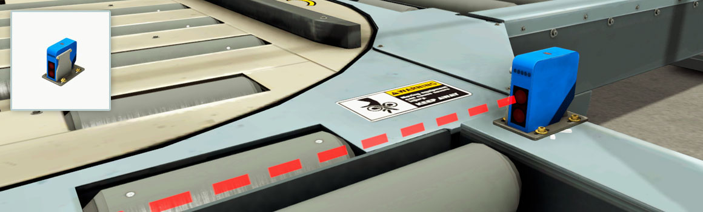

Capacitive sensor - Close range sensor like a real life proximity sensor

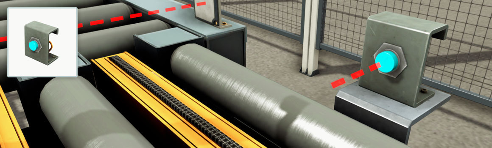

Retro-reflective sensor - It is more like a photo-reflective sensor, it requires a plate to reflect light to trigger the sensor

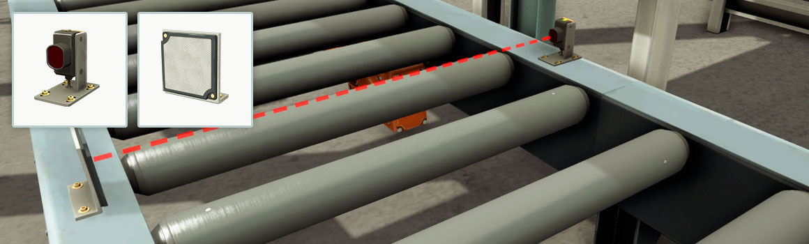

Vision sensor - It a simpler sensor like a camera on top, use to detects different component parts

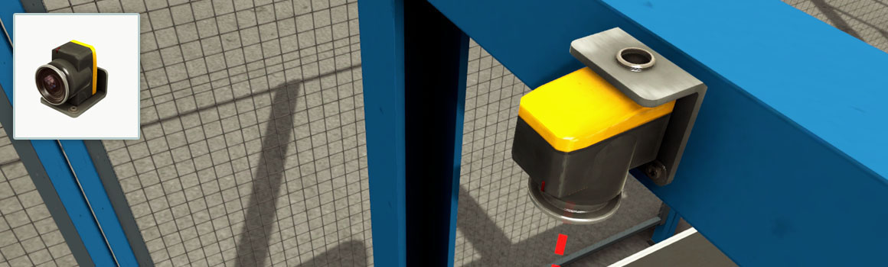

Conveyor belt - A belt that drives objects forward

### Station 1: Control panel

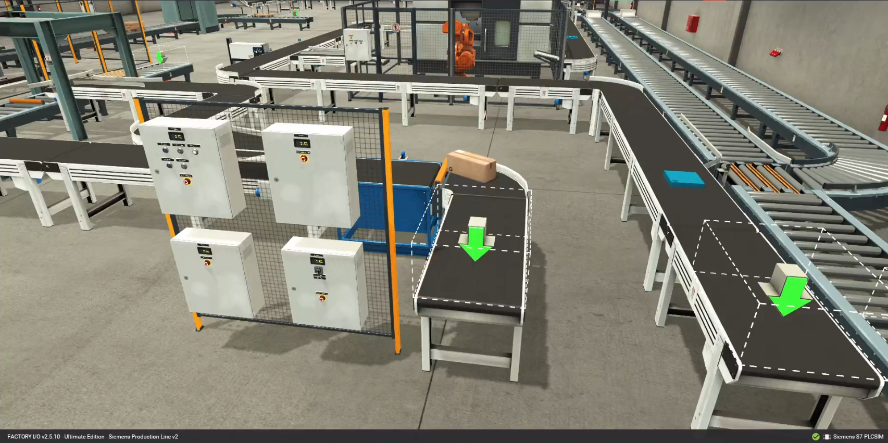

### Station 2: Incoming supply storage

### Station 3: CNC Station & Component assembly

### Station 4: Pallet

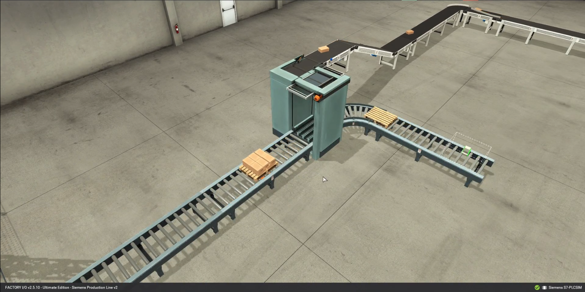

### Station 5: Loading station(autonomous forklifts)

## Traces and analysis

### 1. Sensor Hiccups

Sensors provide unstable signals due to an enormous amount of I/Os installed in a PLC controller, it causes unstable voltage signals that leads to unpredictable signal spikes, in real-life this produces false feedback and causes machine breakdown. 70% of my tests were ran to overcome this issue, the only way to overcome this is to add delay transitions.  

### 2. Analog noises

Analog noise would appear when an analog input is enabled and idled, its not like digital sensors that flickers on and off, analog input produces spikes during sensing. For example, the weight sensor that I have integrated to my 3-axis pick and place station, before sending boxes to it it has to go through a weighting phase, where boxes will be weighted and sorted to the pick and place machines, while the boxes travels to the weight sensor, the sensor produces spikes instead of a linear change in value. This produces false feedback if the line operates in fast-paced, so adding an appropriate delay transition would generate better weight accuracy.

## Final thoughts

This project is not just developing existing technical skills, it also enhances my understanding on utilizing software capabilities, safety practices, understanding the issue through PFMEA and eventually developing a sophisticated solution where I structure ladder logic defensively, every logic should have a way in, a way out, and a way to fail safely. Not all PLC programmed operations are perfect, but as controls designers we makes systems that are scalable and easy to maintain.

A well built production lines can still make mistakes:
[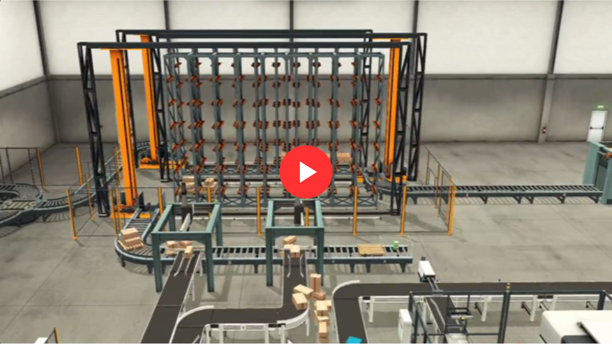](https://youtu.be/rqt-PdUesNc)

For someone that comes with minimal hands-on PLC experience, Factory I/O is a game-changer as it was known for its realism simulating real-world conditions for industrial processes, It's a fantastic tool for learning how to integrate sensors and actuators seamlessly. I would recommend utilizing the tool for someone that has enthusiasm towards PLC controls automation. 

### Future research

This project so completely scalable, personally I haven’t touch based on all of the machines yet there are other machine in the simulation software that also have a good learning outcome, but due to time constraints, I wasn’t able to incorporate to my system, it would be a future project for me. Additionally, I mainly done PLC LAD programming, didn’t have the time to create an HMI and design a SCADA system, that would also be on my list.

### Reference

[Factory I/O Part Manual](https://docs.factoryio.com/manual/parts/sensors/)
